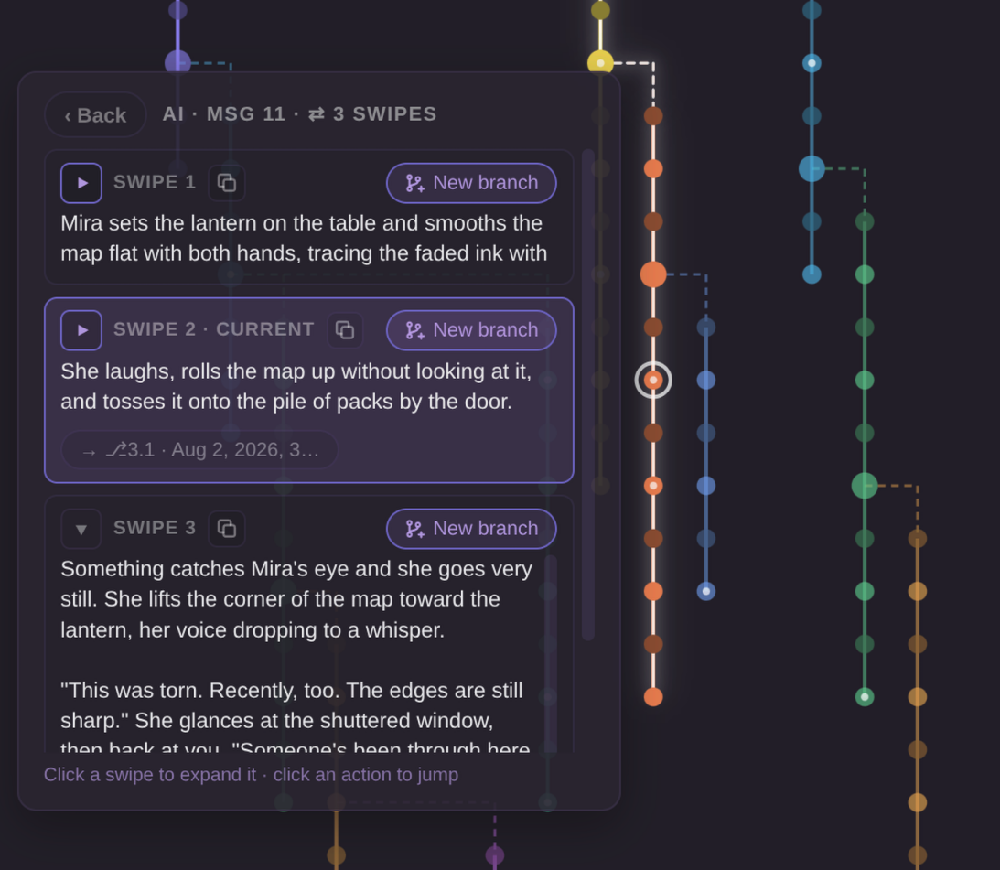
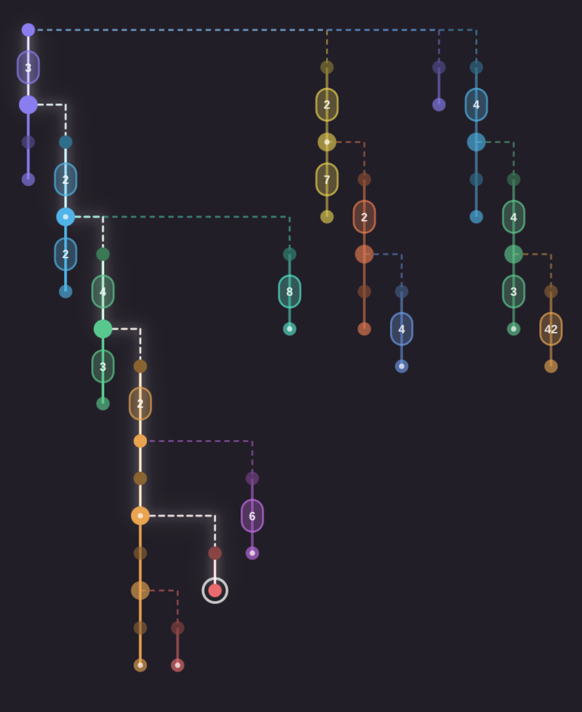
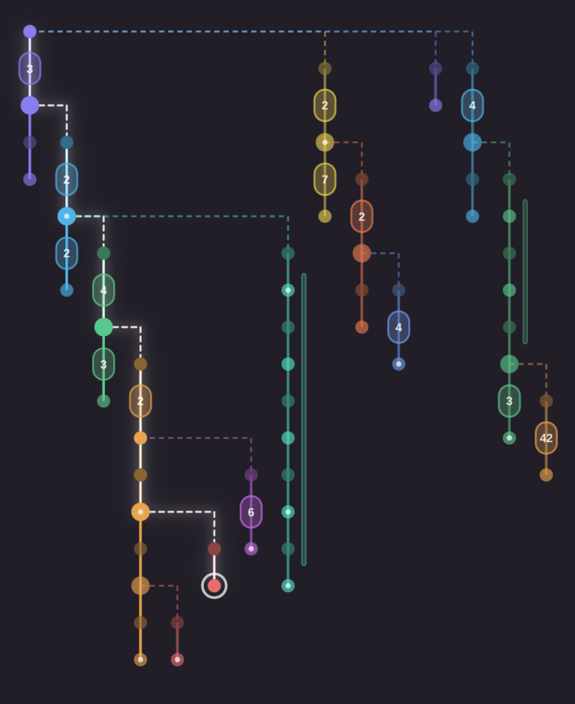
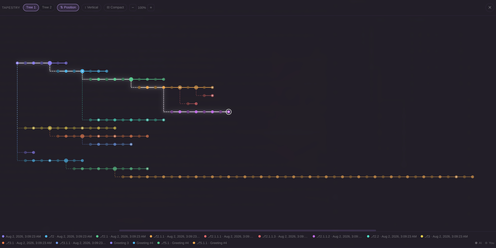

# Tapestry

A [Lumiverse](https://github.com/prolix-oc/Lumiverse) Spindle extension that shows a character's whole chat history as one interactive branch tree. Every chat, branch, fork point and swipe in a single map you can explore, jump around in, and branch from.

> Tapestry is an independent, unofficial community extension. It is not affiliated with, endorsed by, or supported by the Lumiverse project.

## Features

- **Full branch tree map**: All of a character's chats are linked into one tree using their branch metadata, and each branch gets its own colored lane. The chat you're in is highlighted.
- **Live position tracking**: As you scroll through your chat, a ring in the tree follows the message you're reading, back through parent branches to the root.
- **Node previews**: Hover a node to preview the message, or keep hovering (tap on mobile) to read the whole thing. Clicking a node jumps to that message, even if it's far back in history and hasn't loaded yet.
- **Branch Creation**: You can start a new branch from any node right from the map with the new branch button () in its preview, or from a specific swipe in the swipe list. The original chat isn't changed.
- **List Swipes**: Messages with more than one swipe (or greeting) are marked. Click "⇄ N swipes" to open the swipe list, where you can read each one, see which branches continue from which swipe, and jump between them.

  
- **Step through messages**: The ◀ ▶ buttons in a preview move to the previous or next message. On a highlighted node they follow your current chat's whole path, up through every fork point to the root and back down. On desktop, clicking one also lets you use the ← → arrow keys until you click away or press Esc.
- **Copy text**: Copy any message (⧉) from its preview, or any single swipe from the swipe list, without having to go find it in the chat.
- **Fullscreen mode**: (⛶) opens up a large window view, with options for a horizontal or vertical layout, zoom (buttons, Ctrl+scroll or pinch), drag to pan, and tabs when a character has more than one separate tree.
- **Compact mode**: (⊟ Compact) collapses long straight runs of messages into pills so big trees stay readable. Click a pill to expand it.

  
  

- **Rename Branches**: Branches can be renamed from the legend (double-click, or long-press on mobile), and clicking a legend entry takes you to that branch. Messages by the LLM are drawn in the branch color and your messages in a darker shade.
- **Touch Controls**: Differently optimized control designs for mobile vs desktop, large tap targets, docked previews, ◀ ▶ buttons to step between nodes, and long-press menus.
- **Compatible with SillyTavern Chats**: Chats imported from SillyTavern lose their branch links on import. Tapestry rebuilds them so imported trees look as much like native ones as possible. See [About SillyTavern imports](#about-sillytavern-imports) for what it can and can't recover.

*Fullscreen View*

## Installation

1. Open Lumiverse's extension manager.
2. Add this repository by URL: `https://github.com/BitHappy/Tapestry`
3. Enable it and grant the permissions it asks for.

Tapestry adds its own tab to Lumiverse's chat drawer.

### Permissions

| Permission | Used for |
|---|---|
| `chats` | Finding a character's chats to build the tree |
| `chat_mutation` | Reading messages, renaming branches, and setting the active swipe when you branch from one |

When you create a branch or a new chat, Tapestry uses the same Lumiverse requests as Lumiverse's own buttons, signed in as you. It also reads the character card's greetings for the greetings list. Everything stays inside your own Lumiverse instance: Tapestry makes no external network requests and collects no data.

## Controls

| Action                            | Desktop                                                                                          | Touch                                                                                                        |
| --------------------------------- | ------------------------------------------------------------------------------------------------ | ------------------------------------------------------------------------------------------------------------ |
| Preview a message                 | Hover a node                                                                                     | Tap a node                                                                                                   |
| Read the full message             | Keep hovering, or move onto the preview                                                          | Tap the preview text                                                                                         |
| Jump to a message                 | Click its node                                                                                   | Tap "→ Go to this message"                                                                                   |
| See swipes                        | Hover a node, then "⇄ N swipes"                                                                  | Tap a node, then "⇄ N swipes"                                                                                |
| Branch from a message or swipe    |  in the preview or swipe list | Tap  in the preview, and again to confirm |
| Step to the previous/next message | ◀ ▶ in the preview, then optionally ← → keys                                                     | ◀ ▶ in the preview                                                                                           |
| Copy a message                    | ⧉ in the preview (or on a swipe)                                                                 | Same                                                                                                         |
| Turn on compact mode              | "⊟ Compact" button                                                                               | "⊟ Compact" button                                                                                           |
| Expand/collapse pills             | Click the pill or the expanded bar                                                               | Tap (long-press a pill for details)                                                                          |
| Rename a branch                   | Double-click it in the legend                                                                    | Long-press it in the legend                                                                                  |
| Zoom                              | Buttons or Ctrl+scroll                                                                           | Pinch                                                                                                        |
| Fullscreen                        | ⛶ button                                                                                         | ⛶ button                                                                                                     |

## About SillyTavern imports

SillyTavern stores each branch's parent in the chat file's header, but Lumiverse's importer doesn't carry that over. So every imported branch shows up as its own separate chat, which is why an imported character can look like a pile of near-identical chats instead of one tree.

Tapestry rebuilds the links from what does survive the import, mainly the name ST gives a new branch. In `Branch #42 - 2025-11-03@14h22m09s`, the 42 is the message the branch was made from, so Tapestry knows where to attach it. It also compares message text and swipes, so a branch still attaches in the right place if you swiped after branching.

I tested it against my own ST library of 269 chats. Every branch attached at the correct message, and no unrelated chats got merged into the wrong tree. About a fifth of branches attach to a sibling branch rather than the exact chat they were made from. When two branches split at the same message they're identical up to that point, so there's no way to tell which was the original, but the tree looks the same either way.

If you imported your library more than once with an older version of Lumiverse, you'll have duplicate copies of your chats. Tapestry hides the exact duplicates so they don't show up as doubled branches or extra trees. Nothing is deleted.

**What it can't recover:**

- **Branches you renamed in SillyTavern.** The branch name is the main clue Tapestry has. If you renamed a branch to something that doesn't include `Branch #N` or `Checkpoint #N`, it will show up as its own tree. Other branches aren't affected.

    Renaming imported chats inside Lumiverse (including from Tapestry's legend) is fine if you imported with a Lumiverse version from mid-August 2026 or later, since those imports remember the original SillyTavern filename. With older imports, the links are rebuilt from the current name every time the tree loads, so removing the `Branch #N` part will make the chat come loose from its tree. Keep it somewhere in the name (`Branch #42 - the good ending` works fine). Branches made in Lumiverse itself can be renamed however you like, since they have real branch data.

- **Separate chats with the same start.** Different playthroughs with one character often share a long opening, so Tapestry won't merge chats that don't have a branch marker in the name. Two trees is better than one wrong one.
- **Group chats.** Lumiverse imports all of a group's chats under one shared name with no branch data, so they always show up as separate trees (under the group's first member).

None of this affects branches made in Lumiverse. Those have real branch data and are used as-is.

## Feedback

This is a beta, so bug reports and suggestions are very welcome. Please [open an issue](https://github.com/BitHappy/Tapestry/issues) with what you expected, what happened, and a screenshot of the tree if something looks wrong.

## Inspiration

Tapestry was inspired by [Timelines](https://github.com/SillyTavern/SillyTavern-Timelines) for SillyTavern. Tapestry is a separate project written from scratch for Lumiverse.

## License

[MIT](LICENSE)
